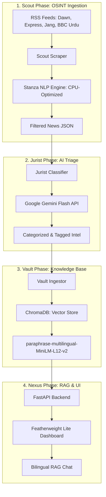

# 🛡️ Vigilance-PK Pro: Elite Multilingual Human Rights Triage

**Vigilance-PK Pro** is an OSINT (Open Source Intelligence) platform designed for the automated triage and analysis of human rights violations in Pakistan. It leverages a decoupled architecture to process multilingual news feeds (Urdu and English), categorize them using LLMs, and provide a real-time RAG (Retrieval-Augmented Generation) dashboard.

---

## 🛰️ System Architecture

The platform follows a modular **Scout-Jurist-Vault** pipeline, ensuring high precision and low-latency intelligence synthesis.



---

## 💎 Key Features

### 🌍 Bilingual Intelligence Engine
*   **Cross-Lingual Retrieval**: Query in English to retrieve Urdu news sources.
*   **Stanza Urdu NLP**: High-precision normalization and lemmatization of Urdu text on CPU to save VRAM.
*   **Universal Translator**: Automated pre-processing of Urdu context for the LLM judge during evaluations.

### 🧠 Advanced AI Triage (The Jurist)
*   **Gemini Flash API / Ollama**: Hybrid inference support for both cloud (Gemini) and local (Qwen/Llama) models.
*   **Two-Tier Taxonomy**: Automated mapping of reports to HRCP (Human Rights Commission of Pakistan) categories.
*   **Grounded Analyst Prompting**: Hardened system prompts and zero-temperature configurations to eliminate hallucinations.

### 📊 Featherweight Analytical Dashboard
*   **Zero-Dependency UI**: A high-performance dashboard built with Vanilla HTML/JS and Tailwind CSS. No `node_modules` required.
*   **Real-time Streaming**: RAG responses delivered via Server-Sent Events (SSE) with live internal status updates.
*   **Source Citation**: Every claim is linked back to the original verified news source (BBC, Dawn, Jang, etc.).

---

## 🛠️ Technology Stack

| Layer | Technology |
| :--- | :--- |
| **Backend** | Python 3.11, FastAPI, Uvicorn |
| **Frontend** | Vanilla HTML5, Tailwind CSS (CDN), Lucide Icons |
| **NLP** | Stanza (Urdu/English), Sentence-Transformers |
| **LLM** | Google Gemini (Flash 1.5/2.0), Ollama (Qwen2.5/Llama3) |
| **Database** | ChromaDB (Vector Database) |
| **Evaluation** | DeepEval (RAG Faithfulness & Relevancy) |

---

## 🚀 Installation & Setup

### 1. Prerequisites
- Python 3.11+
- Google Gemini API Key (Optional, for cloud-based inference)

### 2. Environment Setup
```bash
# Install dependencies
pip install -r requirements.txt

# Configure Environment
cp .env.example .env
# Edit .env and add your GOOGLE_API_KEY or select your OLLAMA_MODEL
```

### 3. Execution
```bash
# Start the Intelligence API
uvicorn src.api:app --reload --port 8000

# Open the Dashboard
# Simply open 'lite-web/index.html' in any modern web browser.
```

### 4. Intelligence Audit
To verify the system's analytical accuracy:
```bash
deepeval test run tests/test_eval_rag.py
```

---

## 🛡️ Ethics & Compliance
Vigilance-PK is built to support human rights defenders. The system prioritizes local processing and data sovereignty to ensure the highest level of security for sensitive intelligence logs.

---