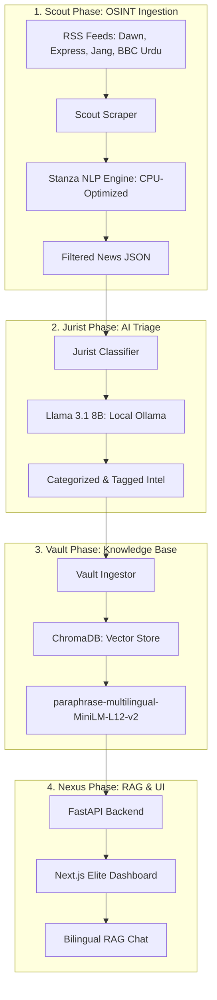

# 🛡️ Vigilance-PK Pro: Elite Multilingual Human Rights Triage

**Vigilance-PK Pro** is a state-of-the-art OSINT (Open Source Intelligence) platform designed for the automated triage and analysis of human rights violations in Pakistan. It leverages a decoupled architecture to process multilingual news feeds (Urdu and English), categorize them using local LLMs (Llama 3.1 8B), and provide a cinematic, real-time RAG (Retrieval-Augmented Generation) dashboard.

---

## 🛰️ System Architecture

The platform follows a modular **Scout-Jurist-Vault** pipeline, ensuring high precision and low-latency intelligence synthesis.



---

## 💎 Key Features

### 🌍 Bilingual Intelligence Engine
*   **Cross-Lingual Retrieval**: Query in English to retrieve Urdu news sources.
*   **Stanza Urdu NLP**: High-precision normalization and lemmatization of Urdu text on CPU to save VRAM.
*   **Universal Translator**: Automated pre-processing of Urdu context for the LLM judge during evaluations.

### 🧠 Advanced AI Triage (The Jurist)
*   **Llama 3.1 8B Integration**: Local execution for privacy and high-speed classification.
*   **Two-Tier Taxonomy**: Automated mapping of reports to HRCP (Human Rights Commission of Pakistan) categories.
*   **Grounding Analyst Prompting**: Hardened system prompts to eliminate "As an AI model" fallbacks and ensure evidence-based reporting.

### 📊 Elite Analytical Dashboard
*   **Real-time Streaming**: RAG responses delivered via Server-Sent Events (SSE).
*   **Source Citation**: Every claim is linked back to the original verified news source (BBC, Dawn, Jang, etc.).
*   **Fixed Dashboard Layout**: Independent scrolling for the Intel Feed and Command Hub to ensure maximum accessibility.

---

## 🛠️ Technology Stack

| Layer | Technology |
| :--- | :--- |
| **Backend** | Python 3.11, FastAPI, Uvicorn |
| **Frontend** | Next.js 15 (App Router), Tailwind CSS, Framer Motion |
| **NLP** | Stanza (Urdu/English), Sentence-Transformers |
| **LLM** | Ollama (Llama 3.1 8B), Qwen 2.5 3B (Auditor) |
| **Database** | ChromaDB (Vector Database) |
| **Evaluation** | DeepEval (RAG Faithfulness & Relevancy) |

---

## 🚀 Installation & Setup

### 1. Prerequisites
- Python 3.11+
- Node.js 18+
- [Ollama](https://ollama.com/) installed and running.
- Pull required models:
  ```bash
  ollama pull llama3.1:8b
  ollama pull qwen2.5:3b
  ```

### 2. Backend Setup
```bash
# Install dependencies
pip install -r requirements.txt

# Start the Intelligence API
uvicorn src.api:app --reload --port 8000
```

### 3. Frontend Setup
```bash
cd web
npm install
npm run dev
```

### 4. Intelligence Audit
To verify the system's analytical accuracy:
```bash
deepeval test run tests/test_eval_rag.py
```

---

## 🛡️ Ethics & Compliance
Vigilance-PK is built to support human rights defenders. The system operates entirely locally (No data sent to external APIs), ensuring the highest level of security for sensitive intelligence logs.

---

**Developed for the Human Rights Commission of Pakistan (HRCP) / OSINT Community.**
