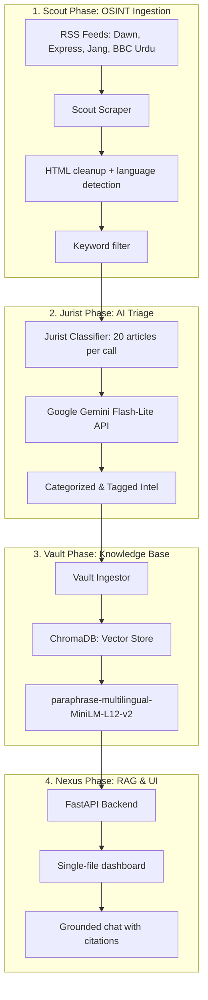

# Vigilance-PK: Human Rights News Triage for Pakistan

**Vigilance-PK Pro** is an OSINT (Open Source Intelligence) platform designed for the automated triage and analysis of human rights violations in Pakistan. It leverages a decoupled architecture to process multilingual news feeds (Urdu and English), categorize them using LLMs, and provide a real-time RAG (Retrieval-Augmented Generation) dashboard.

---

## 🛰️ System Architecture

The platform follows a modular **Scout-Jurist-Vault** pipeline, ensuring high precision and low-latency intelligence synthesis.


```mermaid
graph TD
    subgraph Ingestion_Phase [1. Scout Phase: OSINT Ingestion]
        A[RSS Feeds: Dawn, Express, Jang, BBC Urdu] --> B[Scout Scraper]
        B --> C[HTML cleanup + language detection]
        C --> D[Keyword filter]
    end

    subgraph Intelligence_Phase [2. Jurist Phase: AI Triage]
        D --> E[Jurist Classifier: 20 articles per call]
        E --> F[Google Gemini Flash-Lite API]
        F --> G[Categorized & Tagged Intel]
    end

    subgraph Storage_Phase [3. Vault Phase: Knowledge Base]
        G --> H[Vault Ingestor]
        H --> I[ChromaDB: Vector Store]
        I --> J[paraphrase-multilingual-MiniLM-L12-v2]
    end

    subgraph Presentation_Phase [4. Nexus Phase: RAG & UI]
        J --> K[FastAPI Backend]
        K --> L[Single-file dashboard]
        L --> M[Grounded chat with citations]
    end
```

---

## 💎 Key Features

### 🌍 Bilingual Intelligence Engine
*   **Cross-Lingual Retrieval**: Query in English to retrieve Urdu news sources.

### 🧠 Advanced AI Triage (The Jurist)
*   **Gemini Flash API**: Cloud inference for both classification and chat, so the backend fits a free-tier host.
*   **Two-Tier Taxonomy**: Automated mapping of reports to HRCP (Human Rights Commission of Pakistan) categories.
*   **Grounded Analyst Prompting**: Hardened system prompts and zero-temperature configurations to eliminate hallucinations.

### 📊 Dashboard
*   **One self-contained file**: `lite-web/index.html`, plain HTML/CSS/JS. No build step, and no CDN scripts, icon libraries or web fonts: an analyst's browser makes no third-party requests.
*   **Triage feed**: each report shows a severity label, source, date, HRCP categories and the classifier's reason for the rating. Titles link to the original article; Urdu renders right-to-left.
*   **Streaming answers**: chat replies stream in as newline-delimited JSON, with progress messages.
*   **Source citation**: every claim cites a source and date, and each answer lists the reports it searched.
*   **Light and dark**: follows the operating system setting.

---

## 🛠️ Technology Stack

| Layer | Technology |
| :--- | :--- |
| **Backend** | Python 3.11, FastAPI, Uvicorn |
| **Frontend** | Plain HTML, CSS and JavaScript (single file, no dependencies) |
| **Embeddings** | Sentence-Transformers (multilingual MiniLM) |
| **LLM** | Google Gemini (Flash) |
| **Database** | ChromaDB (Vector Database) |
| **Evaluation** | DeepEval (RAG Faithfulness & Relevancy) |

---

## 🚀 Installation & Setup

### 1. Prerequisites
- Python 3.11+
- Google Gemini API Key (Optional, for cloud-based inference)

### 2. Environment Setup
```bash
# Install runtime dependencies
pip install -r requirements.txt

# Or, for development (adds pytest + deepeval)
pip install -r requirements-dev.txt

# Configure Environment
cp .env.example .env
# Edit .env and set GOOGLE_API_KEY and ADMIN_KEY (see comments in the file)
```

### 3. Execution
```bash
# Start the Intelligence API
uvicorn src.api:app --reload --port 8000

# Open the Dashboard
# Simply open 'lite-web/index.html' in any modern web browser.
```

Press the sync button to pull new reports. The dashboard asks for the
`ADMIN_KEY` once per tab. Each sync only classifies articles it has not seen;
any that fail are retried on the next sync.

### Tests
```bash
python -m pytest
```
Unit tests run offline and never call Gemini.

If you serve the dashboard from anywhere other than your own machine, set
`API_BASE` at the top of the `<script>` block in `lite-web/index.html` to your
deployed API URL, and set `ALLOWED_ORIGINS` in `.env` to match.

### 4. Intelligence Audit
RAG quality is scored with DeepEval. The test suite is not yet in the
repository (see ADR-009); once added it runs with:
```bash
deepeval test run tests/test_eval_rag.py
```

---

## 🛡️ Ethics & Compliance
Vigilance-PK is built to support human rights defenders. The system prioritizes local processing and data sovereignty to ensure the highest level of security for sensitive intelligence logs.

---